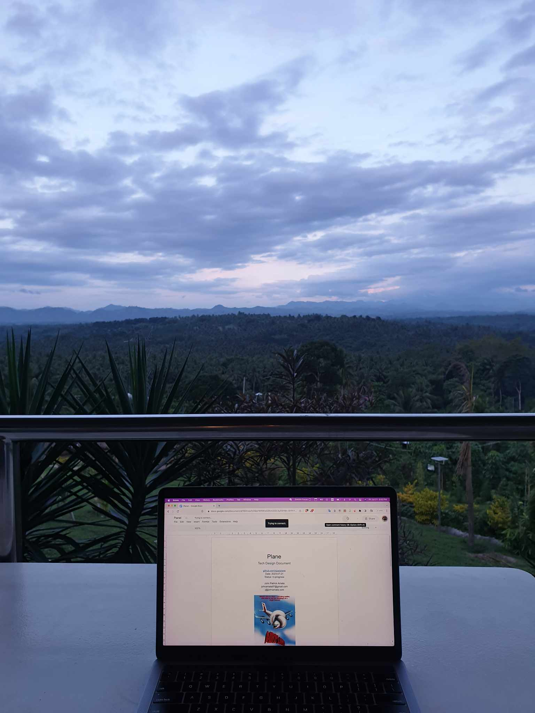

# plane

hands-on system design practice, going to build a toy google flights clone in JS scalable to billions of users

design doc: https://docs.google.com/document/d/160Inojxfz3Qw1WRWwGShmDlZC3yF9YMn-BYPrYXap2k/edit

to start this around august, as i'm currently on vacation:

